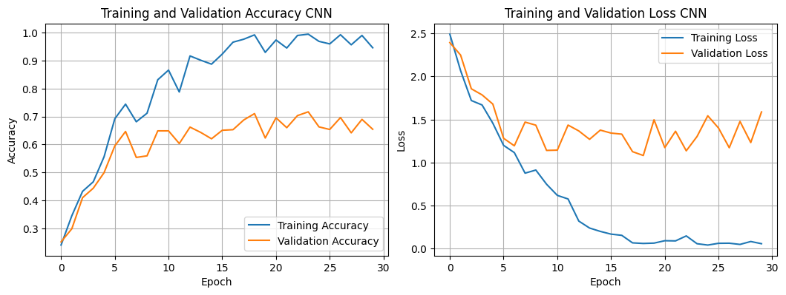
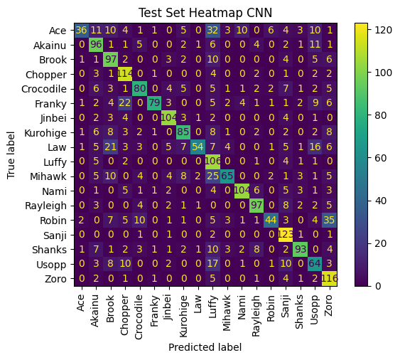
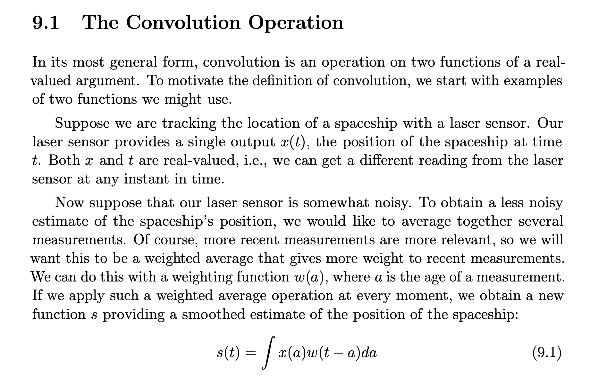
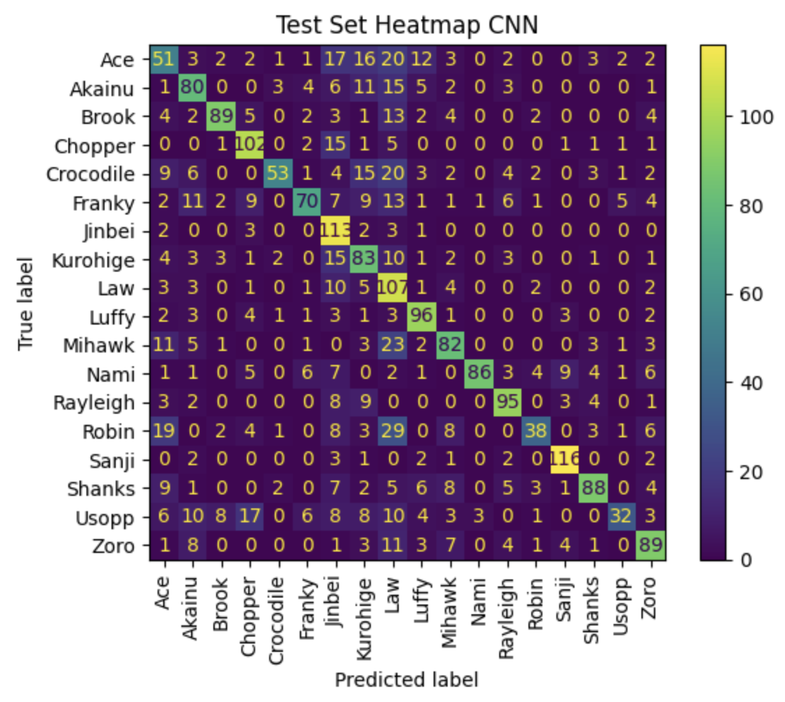
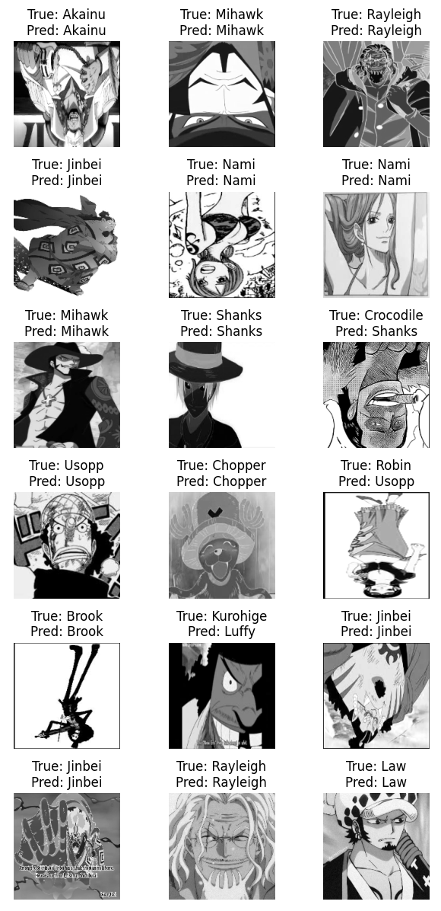

## 1. Convolutional Neural Network Results (RGB)
- Test set accuracy $\approx$ 66.95%
- So far overfits (potential solution -> better dataset preprocessing)
  

   

## 

   

## 2. Convolutional Neural Network Results (Greyscale)

   

## 

   

### 2.1. Prediction Examples

   

## About
- Dataset: [One Piece image classifier, Kaggle](https://www.kaggle.com/datasets/ibrahimserouis99/one-piece-image-classifier)
- Code: [ginesmoratalla](https://github.com/ginesmoratalla)
