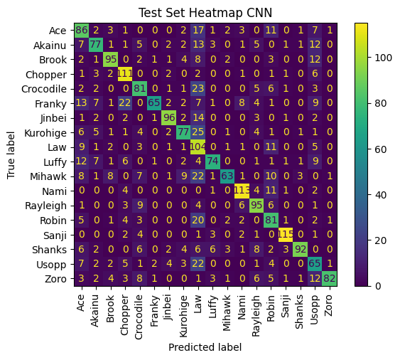

## Convolutional Neural Network Results
So far...

Test set accuracy $\approx$ 66.95%

   

## About
- Dataset: [One Piece image classifier, Kaggle](https://www.kaggle.com/datasets/ibrahimserouis99/one-piece-image-classifier)
- Code: [ginesmoratalla](https://github.com/ginesmoratalla)
